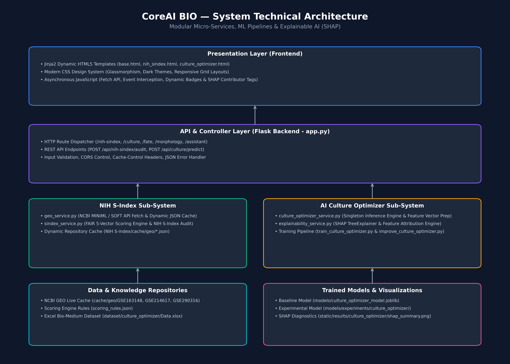

# CoreAI BIO 🧬

**An Open-Source AI Platform for Stem Cell Engineering & Exploratory Microscopy Analysis**

[](https://opensource.org/licenses/MIT)
[](https://www.python.org/)
[](tests/)
[](CHANGELOG.md)

---

## 📌 Project Overview

**CoreAI BIO** is an open-source, modular AI research platform designed for exploratory microscopy analysis, bioinformatics data auditing, and Stem Cell Engineering workflows.

The platform provides quantitative computer vision pipelines, multi-module experiment session integration, automated dataset governance tools, and machine learning interpretability modules.

> **Primary Scientific Focus:** **Stem Cell Engineering** — specializing in human iPSC/ESC colony morphometry, colony coverage estimation, border irregularity index calculation, and non-invasive pluripotency-related morphology assessment.

---

## 🏗️ System Architecture



CoreAI BIO features a decoupled, modular architecture with a Python/Flask backend and a dynamic HTML5/CSS3/JavaScript web interface.

---

## 🌟 Core Modules

### 🧬 1. Stem Cell Colony Morphometry (Primary Validated Workflow)
- **Dedicated Profile:** `Stem Cells (iPSC / ESC)` (`stem_cell`).
- **Colony Morphometrics:** Computes colony count, mean colony area ($\text{px}^2 / \mu\text{m}^2$), perimeter, circularity, compactness ($\text{Solidity}/\text{Circularity}$), border irregularity index ($P/P_{\text{hull}}$), colony coverage (%), and colony density per unit FOV.
- **Colony Size Distribution:** Categorizes colonies into small, medium, and large size bins.
- **Reference Comparison:** Includes benchmark condition comparisons based on label-free iPSC datasets (DOI: [`10.1038/s41598-024-66591-z`](https://doi.org/10.1038/s41598-024-66591-z)).

### 🧫 2. Generic Tissue Morphometry (Validated Workflow)
- **Standardized Field of View Analysis:** Automated circular eyepiece detection, safe inner FOV reduction ($r_{\text{safe}} = 0.875 \times r$), and boundary touch exclusion.
- **Image Quality Diagnostics:** Measures Laplacian focus variance, intensity contrast, luminance mean, noise estimation, and contour rejection ratios.
- **Independent Status Reporting:** Separates **Technical Pipeline Status** (🟢 `Completed`) from **Scientific Interpretation Confidence** (🟡 `Low` / 🟢 `High`).

### 🔬 3. Research Culture Optimizer
- **Bayesian Optimization:** Predicts culture yield and cell viability from culture parameters (temperature, pH, dissolved $O_2$, glucose, serum %).
- **SHAP Interpretability:** Feature importance attribution explaining model predictions.

### 🧬 4. Cell Fate & DGE Analyzer
- **Differential Gene Expression (DGE):** Calculates log2 fold-changes, adjusted p-values, Volcanoplot visualizer, and candidate biomarker ranking.
- **Dimensionality Reduction:** UMAP clustering across biological sample groups.

### 📊 5. CoreAI Experimental S-Index (FAIR Data Sharing Index)
- **NIH & FAIR Data Governance:** Parses NCBI GEO XML/SOFT metadata for repository datasets.
- **Dynamic Score Calculation:** Independent scoring across 10 metadata fields evaluating repository completeness and FAIR compliance.

### 🧠 6. Central AI Laboratory Workspace
- **Multi-Module Session Architecture:** Consolidating independent result blocks from Cell Morphology, Culture Optimizer, Cell Fate, and S-Index under unified Experiment Sessions (`EXP-2026-XXXX`).
- **Multi-Format Export Engine:** One-click generation of PDF summaries, CSV raw datasets, JSON session backups, and Markdown research walkthroughs.

---

## 📊 Profile Maturity & Workflow Scope

| Profile Name | Status | Target Biological Structure | Primary Application |
| :--- | :--- | :--- | :--- |
| **Stem Cells (iPSC / ESC)** | 🟢 **Validated** | Stem Cell Colonies | Primary Workflow — Stem Cell Engineering |
| **Generic Tissue** | 🟢 **Validated** | Morphological Regions | Validated Morphometry Proof-of-Concept |
| **Adipose Tissue** | 🟡 **Experimental** | Adipocyte Cavities | Experimental Tissue Pipeline |
| **Skeletal Muscle** | 🟡 **Experimental** | Muscle Fibers | Experimental Tissue Pipeline |
| **Thyroid** | 🟡 **Experimental** | Follicular Structures | Experimental Tissue Pipeline |
| **Pancreas** | 🟡 **Experimental** | Acini & Islet Regions | Experimental Tissue Pipeline |
| **Spinal Cord** | 🟡 **Experimental** | Neuron Candidate Regions | Experimental Tissue Pipeline |
| **Myocardium** | 🟡 **Experimental** | Cardiac Regions | Experimental Tissue Pipeline |
| **Testis** | 🟡 **Experimental** | Candidate Tubule Regions | Experimental Tissue Pipeline |
| **Ovary** | 🟡 **Experimental** | Follicle Candidate Regions | Experimental Tissue Pipeline |

---

## ⚠️ Scientific Disclaimer & Scope

> **Important Notice:** CoreAI BIO is an exploratory computer vision and bioinformatics software platform.
> - Reported morphometric measurements provide quantitative surrogate indicators for research exploration.
> - This software **does not perform clinical diagnosis** and is not intended for medical decision-making.
> - Morphological features alone do not replace molecular biomarker validation (e.g., RNA-seq, OCT4/SOX2 immunostaining).

---

## 🚀 Installation & Setup

### Prerequisites
- **Python 3.10** or higher
- Git

### Quickstart

1. **Clone the Repository:**
   ```bash
   git clone https://github.com/CoreAI-BIO/CoreAI-BIO.git
   cd CoreAI-BIO
   ```

2. **Create and Activate a Virtual Environment:**
   ```bash
   # On macOS/Linux:
   python -m venv .venv
   source .venv/bin/activate

   # On Windows:
   python -m venv .venv
   .venv\Scripts\activate
   ```

3. **Install Dependencies:**
   ```bash
   pip install -r requirements.txt
   ```

4. **Launch the Flask Application Server:**
   ```bash
   python backend/app.py
   ```

5. **Open in Browser:**  
   Navigate to [`http://127.0.0.1:5000`](http://127.0.0.1:5000)

---

## 🧪 Running Automated Tests

Run the complete automated test suite (89 tests verifying pipeline contracts, image processing algorithms, and API endpoints):

```bash
python -m unittest discover tests
```

Expected output:
```text
Ran 89 tests in ~35s
OK
```

---

## 📂 Repository Structure

```text
CoreAI-BIO/
│
├── backend/                        # Python services & Flask API routes
│   ├── app.py                      # Main Flask web application server
│   ├── morphology_service.py       # Computer vision segmentation engine
│   ├── ipsc_dataset_service.py     # iPSC dataset metadata & condition statistics
│   ├── laboratory_service.py       # Central AI Laboratory experiment session manager
│   ├── culture_optimizer_service.py# Culture yield prediction & SHAP explainability
│   ├── cell_fate_service.py        # Differential Gene Expression & UMAP clustering
│   ├── sindex_service.py           # NIH/FAIR data sharing audit engine
│   └── export_service.py           # Multi-format PDF, CSV, JSON report generator
│
├── frontend/                       # Web UI assets and HTML templates
│   ├── templates/                  # Jinja2 HTML templates
│   │   ├── morphology.html         # Morphology & Stem Cell workspace
│   │   ├── laboratory.html         # AI Laboratory Central Workspace
│   │   ├── culture.html            # Research Culture Optimizer workspace
│   │   ├── cell_fate.html          # Cell Fate Analyzer workspace
│   │   └── sindex.html             # FAIR S-Index Audit workspace
│   └── static/                     # CSS stylesheets, JS scripts & figures
│
├── docs/                           # Architecture diagrams & technical specifications
├── tests/                          # Automated unit test suite (89 tests)
├── datasets/                       # GEO metadata & sample benchmark datasets
│
├── README.md                       # Project documentation
├── LICENSE                         # MIT License
├── CHANGELOG.md                    # Release history & version notes
├── CONTRIBUTING.md                 # Contribution guidelines
├── CODE_OF_CONDUCT.md              # Contributor Covenant Code of Conduct
├── CITATION.cff                    # Citation metadata format
├── requirements.txt                # Pinned Python package dependencies
└── .gitignore                      # Git exclusion rules
```

---

## 📖 Citation

If you use **CoreAI BIO** in your research, preprint, or project, please cite it using the [`CITATION.cff`](CITATION.cff) file or the reference below:

```bibtex
@software{CoreAIBIO2026,
  author       = {{CoreAI BIO Development Team}},
  title        = {CoreAI BIO: An Open-Source AI Platform for Stem Cell Engineering \& Exploratory Microscopy Analysis},
  month        = jul,
  year         = 2026,
  publisher    = {GitHub},
  version      = {v1.0.0},
  url          = {https://github.com/CoreAI-BIO/CoreAI-BIO}
}
```

---

## 📜 License

Distributed under the **MIT License**. See [`LICENSE`](LICENSE) for details.
